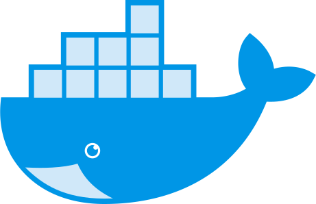

# &nbsp;&nbsp;hello, world

&nbsp;&nbsp;

## Description

Containers Training: Hands-on introduction to Docker.

&nbsp;&nbsp;

## Documentation

Start [here](https://github.com/wsargent/docker-cheat-sheet).

&nbsp;&nbsp;

## Next

- [Fork](https://github.com/artioml/hello-world/fork) and build it yourself
- Start using [adct](https://github.com/ArtiomL/adct)
- Contribute!
